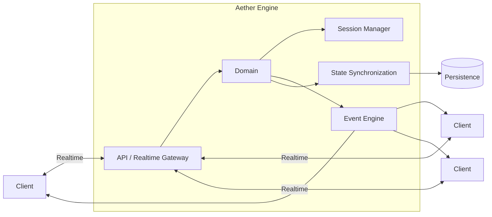
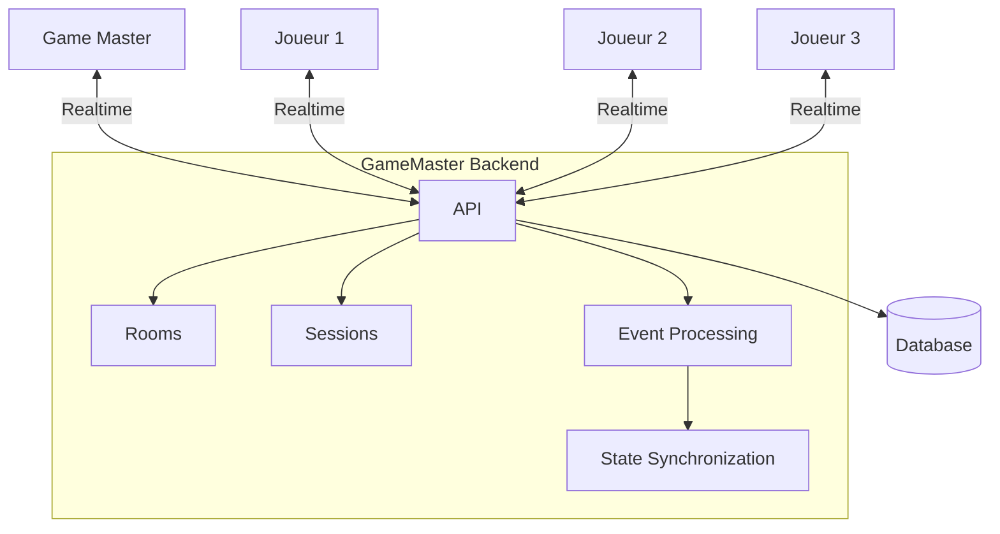
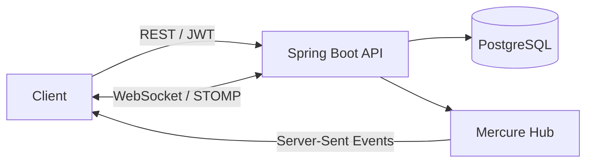
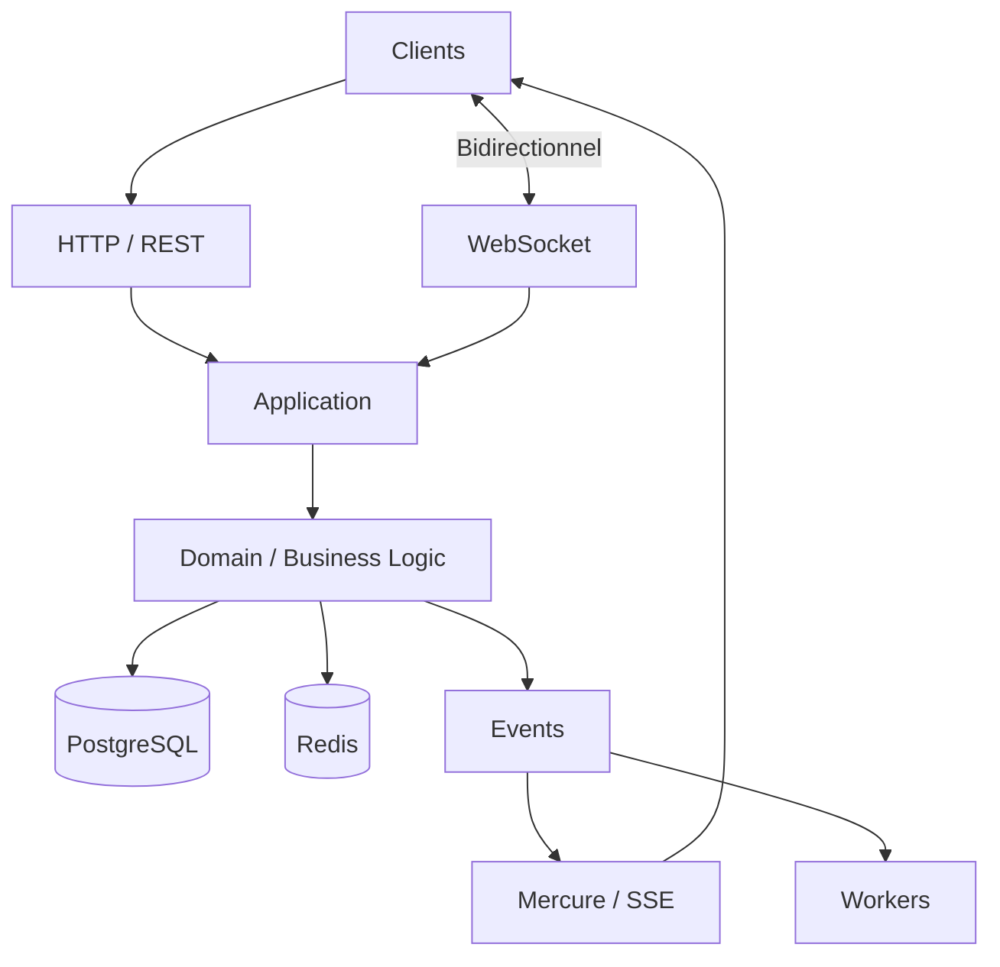
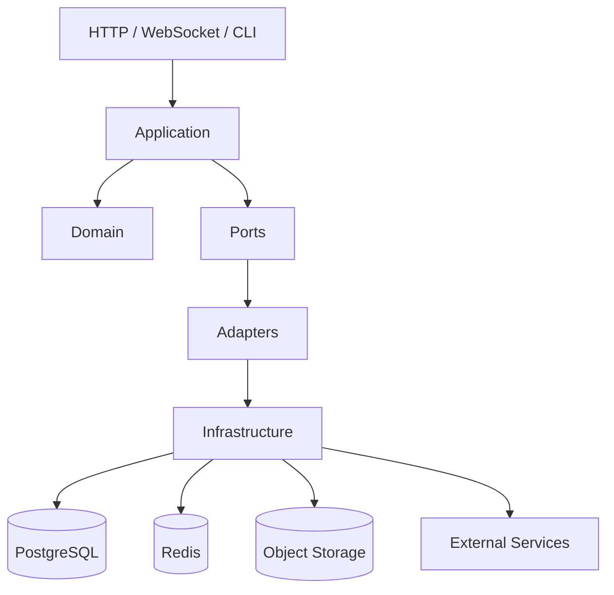
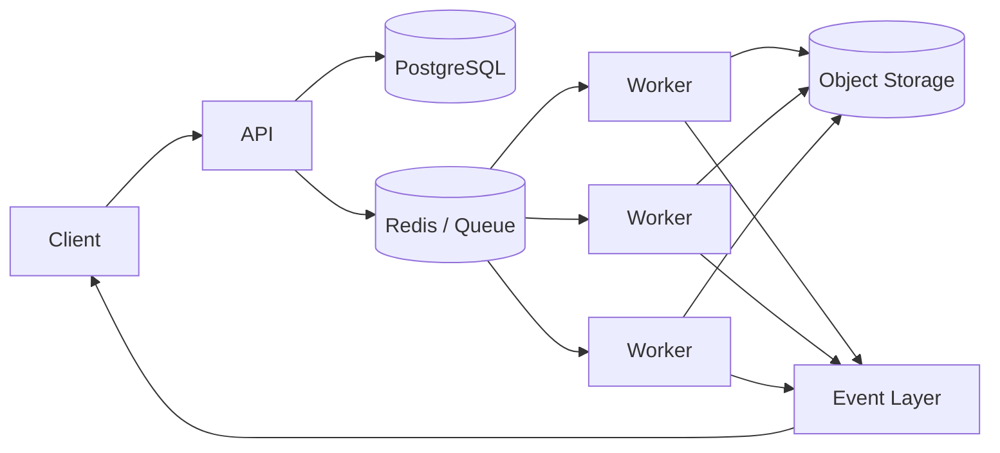
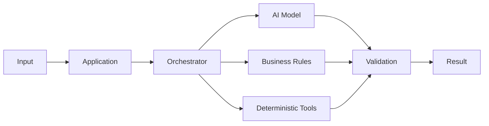
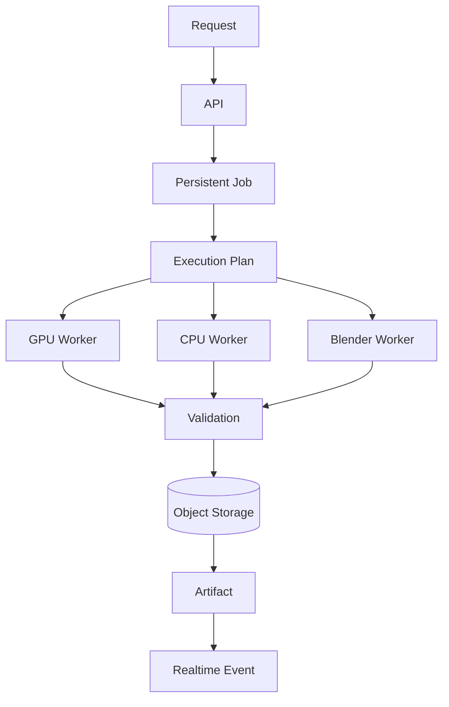

<!--
===============================================================================
  GAËTAN BÈGUE — GITHUB PROFILE
===============================================================================

Structure d'assets recommandée :

assets/
├── banner-profile.webp
├── gamemaster/
│   ├── client.webp
│   └── realtime-demo.webp
├── aether/
│   └── realtime-demo.webp
└── mmo-rpg/
    └── realtime-demo.webp

La bannière principale peut être ajoutée lorsque son design définitif sera prêt.
-->

<div align="center">

# GAËTAN BÈGUE

### Software Developer · Backend · Real-Time Systems

**Go · TypeScript · Java · Distributed Systems · Applied AI**

Toulouse, France

[Portfolio](https://portefolio-projet.onrender.com/) · [LinkedIn](https://www.linkedin.com/in/gaetan-begue-693603105) · [Contact](mailto:gaetan.begue@laplateforme.io)

</div>

---

## À propos

Je suis développeur Full-Stack avec une orientation de plus en plus marquée vers le **backend, les architectures temps réel et les systèmes distribués**.

Je travaille principalement sur des applications dans lesquelles plusieurs composants doivent communiquer, partager un état, traiter des événements ou exécuter des tâches de manière asynchrone.

Mes projets m'ont progressivement amené à travailler sur des problématiques telles que :

* les API REST ;
* WebSocket et Server-Sent Events ;
* Mercure ;
* la synchronisation multi-utilisateurs ;
* les architectures événementielles ;
* les workers et traitements asynchrones ;
* PostgreSQL et Redis ;
* Docker et l'orchestration de services ;
* les architectures hexagonales ;
* les pipelines IA ;
* l'intégration de LLM ;
* l'automatisation de traitements Python et Blender.

Je m'intéresse moins à l'accumulation de frameworks qu'à la manière dont les différents composants d'un système peuvent être **assemblés proprement, testés, observés et maintenus dans le temps**.

---

# Selected Work

## Aether Engine

### Backend temps réel développé en Go

Aether Engine est un projet backend conçu autour de la gestion d'état, de la logique métier et de la communication temps réel.

L'objectif est d'expérimenter une architecture capable de servir de fondation à des applications interactives nécessitant plusieurs clients connectés simultanément.



### Ce que j'y travaille

**Go**
Architecture backend, logique métier et gestion des services.

**Temps réel**
Synchronisation d'état et propagation des événements.

**Conteneurisation**
Environnement reproductible et déploiement via Docker.

**Architecture**
Découplage entre transport, logique métier et infrastructure.

[Voir Aether Engine](https://github.com/Gaetan1303/Aether-Engine)

---

## GameMaster — Legend of the Five Rings

### Backend pour plateforme de jeu de rôle multijoueur

GameMaster est un système permettant à un maître de jeu et plusieurs joueurs de participer à une même session synchronisée.

Le cœur du projet est principalement **backend**.

Il gère notamment :

* les rooms ;
* les sessions ;
* les joueurs connectés ;
* les événements de partie ;
* la communication entre les participants ;
* la synchronisation de l'état ;
* la logique associée aux parties.



### Client de démonstration

L'interface ci-dessous n'est pas le cœur du repository GameMaster : elle représente un **client utilisant l'écosystème backend** et permet de visualiser concrètement une application pouvant être connectée au système.

<p align="center">
  
</p>

> Gestion des personnages, parties, bibliothèque et fonctionnalités multijoueurs autour de l'univers Legend of the Five Rings.

### Architecture

```text
Client Game Master
        │
        │
        ├──────────────┐
        │              │
        ▼              ▼
   REST / Events    Realtime
        │              │
        └──────┬───────┘
               ▼
       GameMaster Backend
               │
       ┌───────┴────────┐
       ▼                ▼
   Persistence       Sessions
                         │
                 ┌───────┴───────┐
                 ▼               ▼
             Joueur A         Joueur B
```

**Stack principale**

`TypeScript / Node.js / Express / MongoDB / Realtime`

[GameMaster Backend](https://github.com/Gaetan1303/GM_L5R) · [Client joueur](https://github.com/Gaetan1303/JDR-test)

---

## MMO-RPG

### Architecture backend multijoueur avec Spring Boot

MMO-RPG est un projet permettant d'expérimenter plusieurs stratégies de communication au sein d'une architecture multijoueur.

Le backend combine communication HTTP classique, authentification, communication bidirectionnelle et diffusion événementielle.



Cette architecture permet d'utiliser différents mécanismes selon la nature des échanges.

### REST

Pour les opérations classiques et les commandes ne nécessitant pas une connexion persistante.

### WebSocket / STOMP

Pour les interactions bidirectionnelles nécessitant une communication directe entre serveur et clients.

### Mercure / SSE

Pour publier et diffuser des événements vers les clients abonnés.

### PostgreSQL

Pour la persistance des données métier.

### Docker Compose

Pour reproduire et orchestrer l'environnement complet.

**Stack**

`Java / Spring Boot / PostgreSQL / WebSocket / STOMP / Mercure / Docker`

[Voir le repository](https://github.com/Gaetan1303/MMO-RPG)

---

# Real-Time Engineering

Une grande partie de mes projets tourne autour d'un même problème :

> Comment plusieurs composants peuvent-ils communiquer efficacement sans transformer le backend en ensemble de dépendances fortement couplées ?

Selon le besoin, j'utilise plusieurs approches.



### HTTP / REST

Utilisé lorsque la communication est ponctuelle et déterministe.

### WebSocket

Utilisé lorsque client et serveur doivent conserver un canal bidirectionnel.

### SSE / Mercure

Utilisé lorsqu'un serveur doit principalement pousser des événements vers plusieurs consommateurs.

### Workers

Utilisés pour sortir du chemin HTTP les opérations longues ou coûteuses.

---

# Backend Architecture

Lorsque la taille du projet le justifie, je préfère éviter que le framework devienne l'architecture de l'application.

Je cherche plutôt à conserver une séparation entre les responsabilités.



Les patterns que j'utilise dépendent du problème rencontré, notamment :

`Repository`

`Adapter`

`Strategy`

`Factory`

`Command`

`Dependency Injection`

`Transactional Outbox`

Je préfère introduire ces abstractions lorsqu'elles résolvent réellement un problème de maintenance ou de couplage plutôt que les appliquer systématiquement.

---

# Asynchronous Processing

Certains traitements ne doivent pas être exécutés directement pendant une requête HTTP.

J'expérimente donc également des architectures basées sur des tâches persistantes et des workers spécialisés.



Ces architectures permettent notamment :

* d'isoler les traitements coûteux ;
* de suivre leur progression ;
* de réessayer certaines opérations ;
* de paralléliser les traitements ;
* de conserver un historique ;
* de publier leur progression en temps réel.

---

# Applied AI & R&D

Je travaille également sur plusieurs projets privés autour de l'intégration de modèles d'intelligence artificielle dans des architectures applicatives classiques.

L'IA y est considérée comme **un composant du système**, et non comme l'ensemble du système.



Je travaille notamment sur :

### LLM et traitement de contexte

* résumés incrémentaux ;
* gestion du contexte ;
* limitation des appels inutiles ;
* traitement événementiel ;
* interaction avec des sessions temps réel.

### Computer Vision

* classification d'images ;
* modèles spécialisés ;
* constitution et exploitation de datasets ;
* expérimentation autour du fine-tuning.

### Pipelines de génération

* orchestration de modèles ;
* ComfyUI ;
* workers Python ;
* stockage des artefacts ;
* validation automatique des résultats.

### Automatisation 3D

* Blender headless ;
* Python ;
* génération et transformation d'assets ;
* pipelines GLB / FBX ;
* préparation de ressources pour des moteurs de jeu.

---

# Exemple de pipeline R&D

Un système de génération ou de traitement ne se résume pas nécessairement à un appel vers un modèle.



J'essaie d'obtenir des pipelines :

**déterministes quand cela est possible**,
**observables**,
**reprenables après erreur**,
**testables**,
et dont les composants peuvent évoluer indépendamment.

---

# Core Technologies

Plutôt qu'une collection exhaustive de technologies, voici celles que j'utilise aujourd'hui le plus régulièrement.

### Backend

```text
Go
TypeScript / Node.js
Java / Spring Boot
PHP
Python
```

### Frontend

```text
Angular
React / Next.js
Vue.js
```

### Data

```text
PostgreSQL
MongoDB
Redis
Object Storage / MinIO
```

### Realtime

```text
WebSocket
Server-Sent Events
Mercure
STOMP
Event-driven communication
```

### Infrastructure

```text
Docker
Docker Compose
Linux
Git / GitHub
CI/CD
```

### R&D

```text
LLM
Computer Vision
ComfyUI
Python automation
Blender automation
AI pipelines
```

---

# Engineering Principles

Quelques principes reviennent régulièrement dans ma manière de travailler.

## Comprendre avant d'abstraire

Je préfère commencer par identifier le domaine, les responsabilités et les flux avant d'introduire des abstractions.

## Séparer métier et infrastructure

La base de données, Redis, un framework HTTP ou un fournisseur externe ne devraient pas définir le cœur du domaine.

## Préférer le déterminisme lorsque c'est possible

Un modèle IA est utile lorsqu'un problème nécessite réellement de l'inférence.

Pour les autres tâches, une règle métier ou un algorithme déterministe reste souvent préférable.

```text
Business Rules
      +
Deterministic Code
      +
AI where relevant
      +
Validation
      =
Controlled System
```

## Tester les comportements importants

Je privilégie particulièrement les tests autour :

* des règles métier ;
* des transitions d'état ;
* des erreurs ;
* des accès concurrents ;
* des frontières entre composants.

## Concevoir pour l'échec

Un réseau tombe.

Un worker peut s'arrêter.

Un service externe peut ne pas répondre.

Une tâche peut être exécutée deux fois.

J'essaie donc progressivement de concevoir mes applications en tenant compte de ces situations plutôt qu'en supposant que tout fonctionnera toujours normalement.

---

# Formation

## Développeur Web et Applications — Bac+2

**La Plateforme_ — Marseille**

Formation en cours.
Fin prévue : **octobre 2026**.

Le cursus couvre notamment :

* développement frontend ;
* développement backend ;
* API REST ;
* SQL et NoSQL ;
* programmation orientée objet ;
* architecture MVC ;
* Git ;
* Docker ;
* développement collaboratif ;
* déploiement.

Mes projets personnels et professionnels me permettent parallèlement d'approfondir des sujets qui dépassent progressivement le cadre du cursus :

**Go**, **architecture logicielle**, **temps réel**, **systèmes distribués**, **workers**, **IA appliquée**, **sécurité** et **industrialisation**.

---

# Currently Exploring

Je continue actuellement à approfondir :

```text
Software Architecture
Distributed Systems
Go
Concurrency
Event-Driven Architecture
Observability
Application Security
CI/CD
Realtime Systems
LLM Architecture
Computer Vision
AI Infrastructure
```

---

# GitHub

<div align="center">


<br />


</div>

> Ces statistiques représentent principalement la quantité de code présente dans mes repositories publics. Elles ne constituent pas une mesure de maîtrise ou une hiérarchie entre les technologies que j'utilise.

---

# Contact

Je suis disponible pour échanger autour du développement backend, du temps réel, de l'architecture logicielle, de Go ou de projets mêlant développement traditionnel et intelligence artificielle.

**Email**
[gaetan.begue@laplateforme.io](mailto:gaetan.begue@laplateforme.io)

**LinkedIn**
[linkedin.com/in/gaetan-begue-693603105](https://www.linkedin.com/in/gaetan-begue-693603105)

**Portfolio**
[portefolio-projet.onrender.com](https://portefolio-projet.onrender.com/)

---

<div align="center">

### Backend · Real-Time · Distributed Systems · Applied AI

**Build systems. Understand them. Improve them.**

</div>
